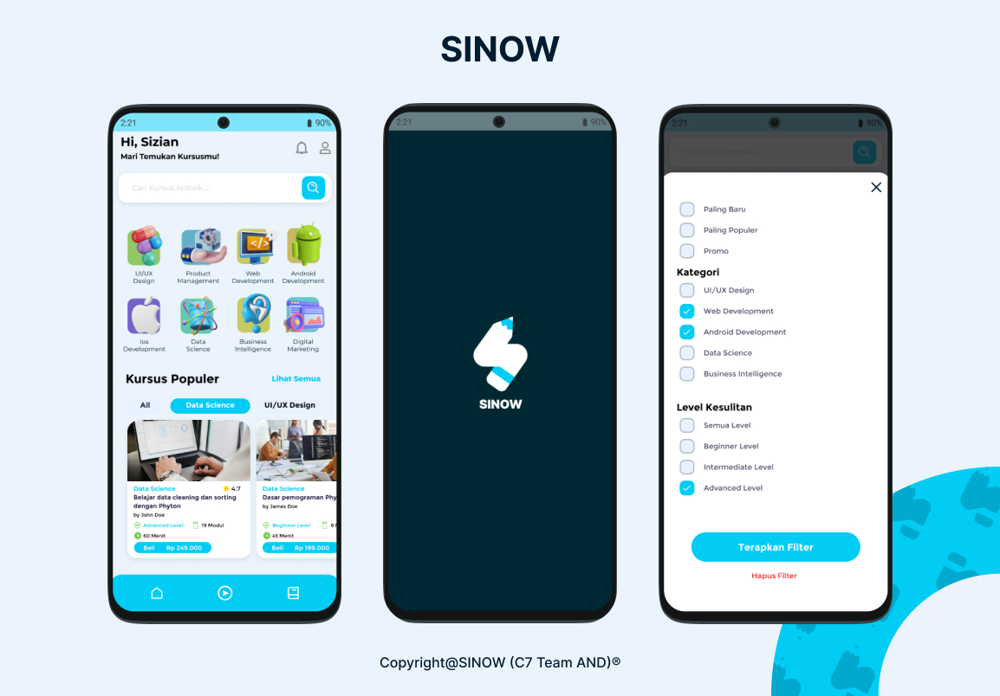
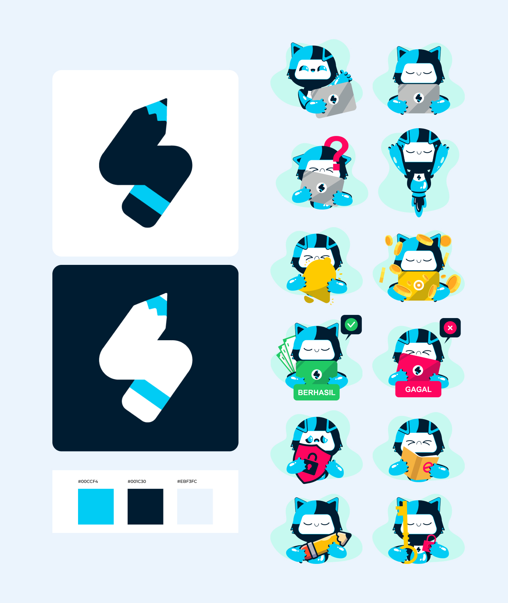

<h1 align="center">SINOW</h1>

  

  
📖 SINOW demonstrates modern Android development with Koin, Coroutines, Flow, Jetpack (ViewModel), and Material Design based on MVVM architecture.

 

## Download
Go to the [Releases](https://drive.google.com/file/d/17GJWm37HXdl6Vr51SqYq5NMX1bis7-gV/view?usp=sharing) to download the latest APK.

## Tech stack & Open-source libraries
- Minimum SDK level 24
- [Kotlin](https://kotlinlang.org/) based, [Coroutines](https://github.com/Kotlin/kotlinx.coroutines) + [Flow](https://kotlin.github.io/kotlinx.coroutines/kotlinx-coroutines-core/kotlinx.coroutines.flow/) for asynchronous.
- Jetpack
    - Lifecycle: Observe Android lifecycles and handle UI states upon the lifecycle changes.
    - ViewModel: Manages UI-related data holder and lifecycle aware. Allows data to survive configuration changes such as screen rotations.
    - DataBinding: Binds UI components in your layouts to data sources in your app using a declarative format rather than programmatically.
    - [Koin](https://insert-koin.io/docs/quickstart/kotlin): Simplify the process of managing and resolving dependencies.
- Architecture
    - MVVM Architecture (View - DataBinding - ViewModel - Model)
    - [Bindables](https://github.com/skydoves/bindables): Android DataBinding kit for notifying data changes to UI layers.
    - Repository Pattern
- [Retrofit2 & OkHttp3](https://github.com/square/retrofit): Construct the REST APIs and paging network data.
- [Gson](https://github.com/google/gson): A modern JSON library for Kotlin and Java.
- [JsonToKotlinClass](https://github.com/wuseal/JsonToKotlinClass): Plugin for Kotlin to convert Json String into Kotlin data class code quickly
- [ksp](https://github.com/google/ksp): Kotlin Symbol Processing API.
- [Turbine](https://github.com/cashapp/turbine): A small testing library for kotlinx.coroutines Flow.
- [Material-Components](https://github.com/material-components/material-components-android): Material design components for building ripple animation, and CardView.
- [Coil](https://github.com/coil-kt/coil): An image loading library for Android backed by Kotlin Coroutines.
- [Exoplayer](https://developer.android.com/guide/topics/media/exoplayer): A media player is an app-level component that allows playback of video and audio files.
- [Koin](https://insert-koin.io/docs/setup/koin/): A smart Kotlin dependency injection library to keep focused on app, not on tools.
- [Groupie](https://github.com/lisawray/groupie): Helps display and manage complex RecyclerView layouts.
- Custom Views
    - [SkeletonLayout](https://github.com/Faltenreich/SkeletonLayout): Implements the Skeleton View pattern and provides an easy way for other developers to enable it in their apps.
    - [FancyToast](https://github.com/Shashank02051997/FancyToast-Android): A library that takes the standard Android toast to the next level with a variety of styling options.
    - [SuperBottomSheet](https://github.com/andrefrsousa/SuperBottomSheet): Displays the bottom sheet in your app with the bonus of animating the status bar color and top rounded corners when scrolling.
    - [LottieAndroid](https://github.com/airbnb/lottie-android): Show lottie animation in apps

## Architecture
**SINOW** is based on the MVVM architecture and the Repository pattern, which follows the [Google's official architecture guidance](https://developer.android.com/topic/architecture).

The overall architecture of **SINOW** is composed of two layers; the UI layer and the data layer. Each layer has dedicated components and they have each different responsibilities, as defined below:

**SINOW** was built with [Guide to app architecture](https://developer.android.com/topic/architecture), so it would be a great sample to show how the architecture works in real-world projects.

### Architecture Overview

- Each layer follows [unidirectional event/data flow](https://developer.android.com/topic/architecture/ui-layer#udf); the UI layer emits user events to the data layer, and the data layer exposes data as a stream to other layers.
- The data layer is designed to work independently from other layers and must be pure, which means it doesn't have any dependencies on the other layers.

With this loosely coupled architecture, you can increase the reusability of components and scalability of your app.

### UI Layer

The UI layer consists of UI elements to configure screens that could interact with users and [ViewModel](https://developer.android.com/topic/libraries/architecture/viewmodel) that holds app states and restores data when configuration changes.
- UI elements observe the data flow via [DataBinding](https://developer.android.com/topic/libraries/data-binding), which is the most essential part of the MVVM architecture.
- With [Bindables](https://github.com/skydoves/bindables), which is an Android DataBinding kit for notifying data changes, you can implement two-way binding, and data observation in XML very clean.

### Data Layer

The data Layer consists of repositories, which include business logic, such as querying data from the local database and requesting remote data from the network. It is implemented as an offline-first source of business logic and follows the [single source of truth](https://en.wikipedia.org/wiki/Single_source_of_truth) principle. 

**SINOW** is an offline-first app is an app that is able to perform all, or a critical subset of its core functionality without access to the internet.
So users don't need to be up-to-date on the network resources every time and it will decrease users' data consumption. For further information, you can check out [Build an offline-first app](https://developer.android.com/topic/architecture/data-layer/offline-first).

## Open API

SINOW using the [SinowAPI](https://sinow-production.up.railway.app/api-docs/#/) for constructing RESTful API. 
SINOW uses SinowAPI to create RESTful APIs.
SinowApi provides a RESTful API interface to display a list of courses containing learning videos.

## Find this repository useful? ❤️
Support it by joining __[SINOW](https://github.com/Budiart18/SiNow)__ for this repository.  
Also, follow us on GitHub for my next creations! 🤩  
- [Ragil Budiarto](https://github.com/Budiart18) 
- [Dian Permata Kusuma](https://github.com/dyanpk) 
- [Muhammad Farhan Al Anzhari](https://github.com/MuhammadFarhanAlAnzhari) 
- [Ivanston Simbolon](https://github.com/ivanston1999) 
- [Randika Akhdan Afghani](https://github.com/Randika16)

